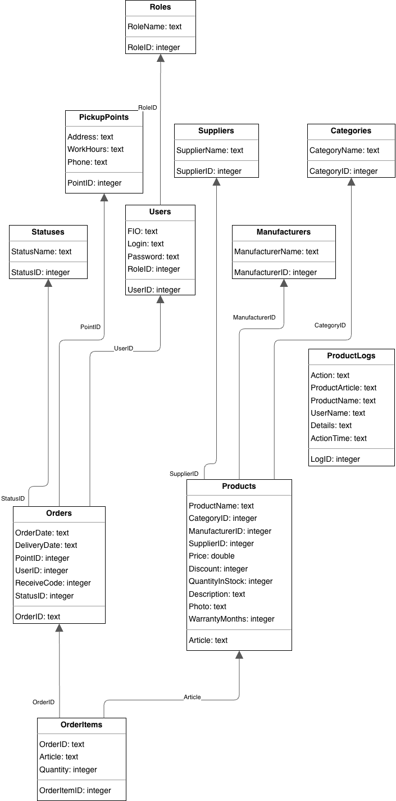
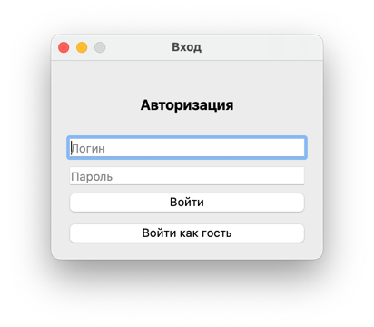
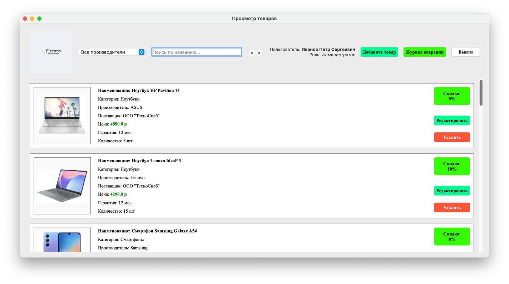
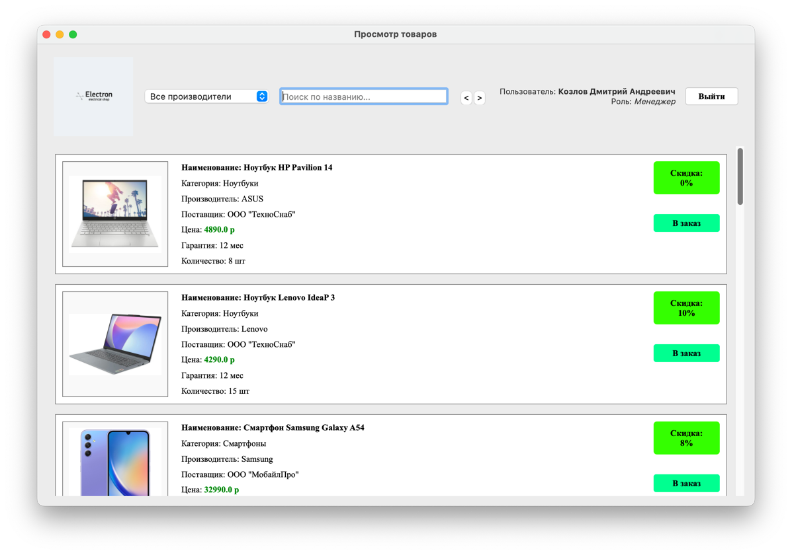
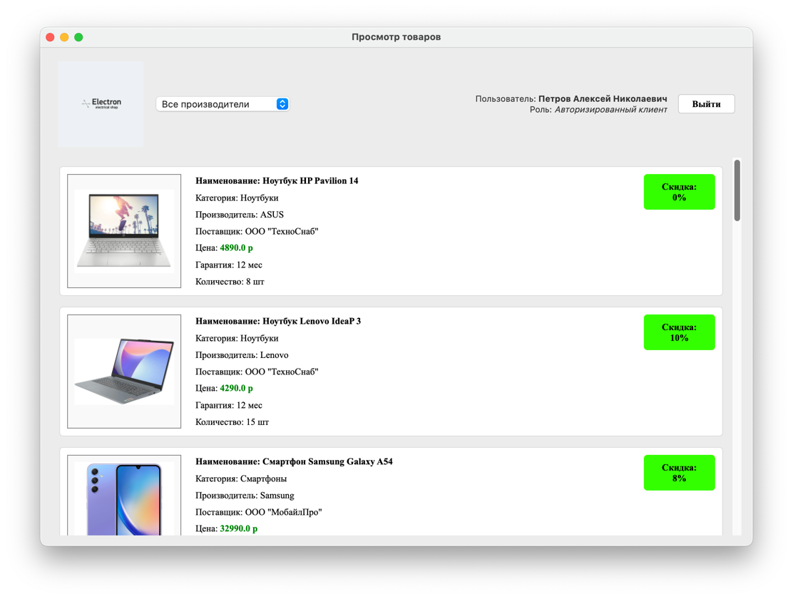
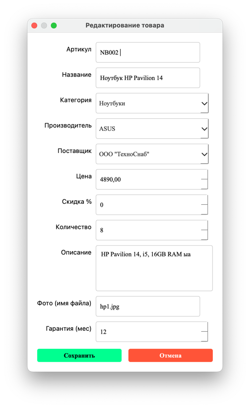
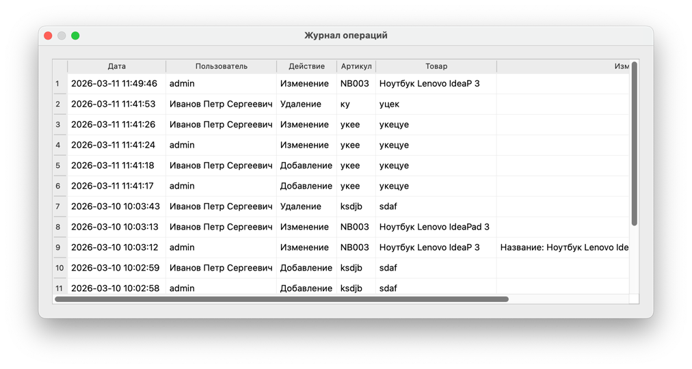

# Учебная практика за 8 семестр #

#### Ход работы ####

##### ER-диаграмма БД #####

##### Описание стека #####

Были использованы библиотеки:   

1. **PyQt5**  
   Основная библиотека для создания графического интерфейса (GUI) программы.

2. **sqlite3**  
   Библиотека для работы с базой данных SQLite.

3. **datetime**  
   Библиотека для работы с датой и временем.

4. **sys**  
   Стандартная библиотека Python, используется для запуска и завершения программы.

##### Работа программы #####

1. Окно входа    
При запуске программы вы увидите окно авторизации:  
 

2. Права
При вводе верного логина и пароля вы попадёте на главное окно в зависимости от роли пользователя оно может отличаться:
* Администратор:  
 
> Обладает полным набором прав

* Менеджер:  

> Обладает только возможностями просмотра, поиска, фильтрации и добавления в заказ

* Авторизированный клиент:  

> Может просматривать товары  

* Гость: 

> Может просматривать товары

3. Добавление/Редактирование товара
При нажатии на соответствующую кнопку откроется окно добавления/редактирования товара:  

   
4. История операций    
Тут будет список всех операций:
